<div align="center">


&nbsp;&nbsp;&nbsp;

&nbsp;&nbsp;&nbsp;

&nbsp;&nbsp;&nbsp;


# observability-lab

**A fully automated observability stack on Azure — Terraform, Ansible, k3s, Prometheus, Grafana & Loki, with SLO-based alerting**


</div>

---

## What is this?

A self-built, end-to-end observability lab, provisioned entirely as code on Azure.

**Terraform** stands up the infrastructure (VM, networking, a static public IP, and a daily auto-shutdown schedule to protect a fixed credit budget). **Ansible** then takes over completely: installing k3s, deploying the full monitoring stack via Helm (`kube-prometheus-stack` + `loki-stack`), shipping a small instrumented Go service, wiring up Traefik Ingress, and configuring SLO-based email alerting — all idempotently, so the whole stack can be rebuilt from scratch with two commands.

---

## Architecture

```
Terraform (Azure, Japan East)
  └── VM (Standard_D2s_v3) + VNet/NSG + static Public IP + daily auto-shutdown
        └── Ansible (idempotent, role-based)
              ├── k3s            — single-node Kubernetes (Traefik ingress built in)
              ├── Helm
              │     ├── kube-prometheus-stack → Prometheus + Grafana + Alertmanager
              │     └── loki-stack            → Loki + Promtail
              ├── app            — Go service (Deployment + Service + ServiceMonitor)
              └── ingress        — Traefik routes for Grafana & Prometheus

Prometheus  → scrapes the app's /metrics, evaluates SLO rules
Alertmanager → fires on SLO breach → Gmail SMTP → email notification
Promtail    → ships container logs → Loki → queried live from Grafana Explore
```

---

## Stack

| Layer | Tool | Role |
|---|---|---|
| IaC | **Terraform** | Provisions the Azure VM, VNet/NSG, static public IP, auto-shutdown |
| Config management | **Ansible** | Installs k3s, deploys every Helm chart, the app, and Ingress — fully idempotent |
| Orchestration | **k3s** | Lightweight single-node Kubernetes cluster |
| Packaging | **Helm v3** | Deploys `kube-prometheus-stack` and `loki-stack` |
| Metrics & Alerts | **Prometheus + Alertmanager** | Scrapes `/metrics`, evaluates SLO rules, sends alerts |
| Dashboards | **Grafana** | SLI dashboard, cluster & node dashboards, Loki log explorer |
| Logs | **Loki + Promtail** | Aggregates structured JSON logs from every pod |
| Ingress | **Traefik** | Built into k3s — exposes Grafana & Prometheus externally |
| App | **Go** | Small instrumented API simulating realistic traffic and failures |
| Notifications | **Alertmanager → Gmail SMTP** | Email on SLO breach and on resolve |

---

## SLI / SLO / SLA

Full definitions and PromQL queries live in [`sli-slo/definitions.md`](sli-slo/definitions.md).

### SLI
- **Availability** — percentage of `/work` requests that do *not* return a 5xx status
- **Latency (p95)** — 95th percentile response time for `/work`

### SLO

| SLI | Target |
|---|---|
| Availability | ≥ 90% |
| p95 Latency | < 200ms |

> The target is intentionally 90% rather than a typical 99.5% — the app simulates a ~10% failure rate on purpose, to generate realistic signal for this lab.

### SLA
85% monthly availability for `/work`, measured over rolling 30-day windows — kept below the internal SLO to leave error-budget margin for planned maintenance.

---

## Repository Structure

```
observability-lab/
├── ansible/
│   ├── group_vars/          ← secrets.yml (gitignored): SMTP + Grafana admin password
│   ├── roles/                ← helm, prometheus, loki, ingress, app
│   ├── .gitignore
│   ├── inventory.ini
│   └── playbook.yaml
├── app/
│   ├── .dockerignore
│   ├── Dockerfile
│   ├── go.mod
│   ├── go.sum
│   └── main.go
├── docs/
│   ├── screenshots/
│   └── grafana-dashboard.json
├── sli-slo/
│   └── definitions.md
└── terraform/
    ├── main.tf
    ├── outputs.tf
    ├── providers.tf
    └── variables.tf
```

---

## Screenshots

### Full `ansible-playbook` run, applied idempotently end to end
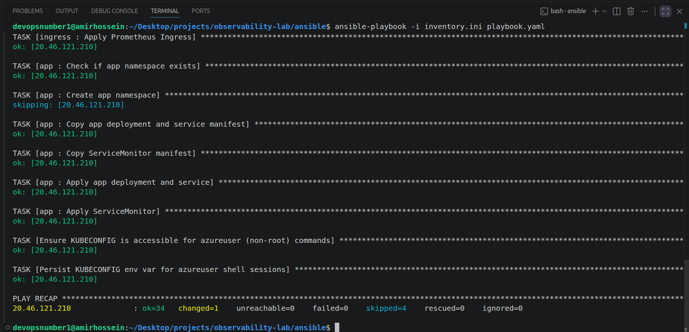

### Every component running across `app`, `monitoring`, `logging`, and `kube-system`
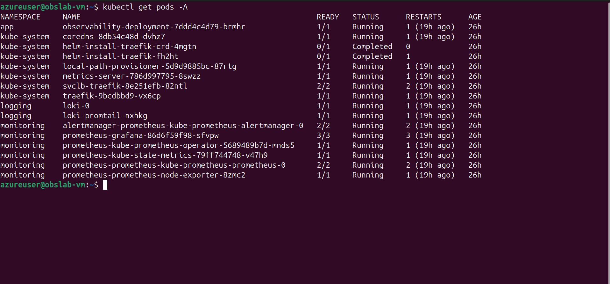

### Live SLI dashboard — availability, p95 latency, and request rate for `/work`
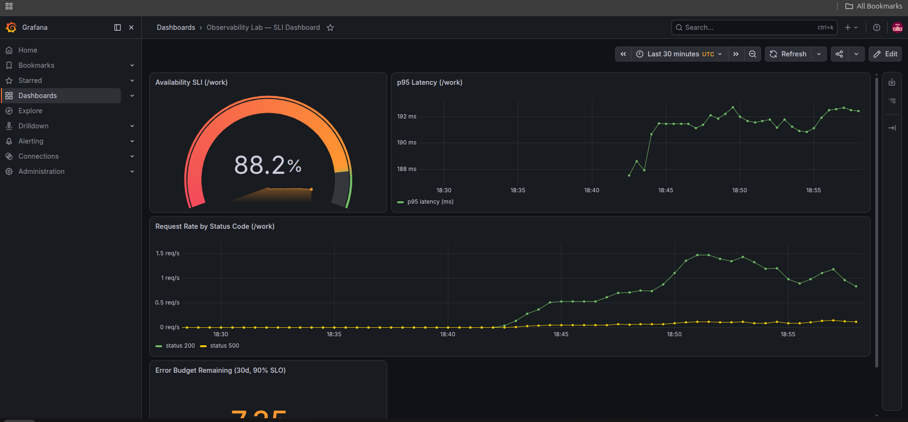

### Kubernetes cluster compute resources
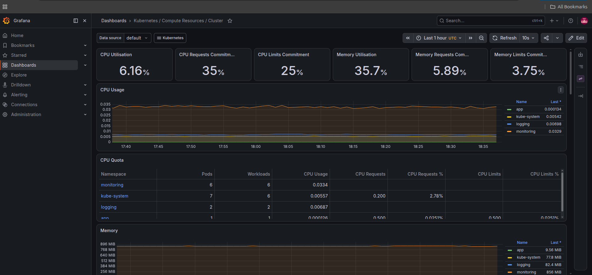

### Node Exporter system metrics
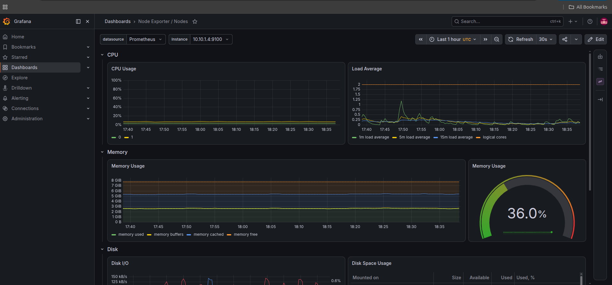

### Structured application logs queried live through Grafana Explore → Loki
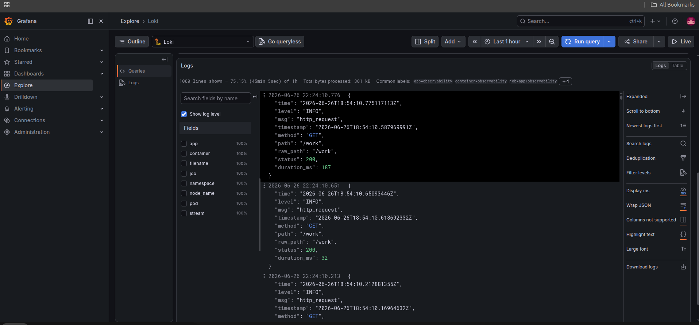

### SLOAvailabilityBreach moving into PENDING as the error budget runs out
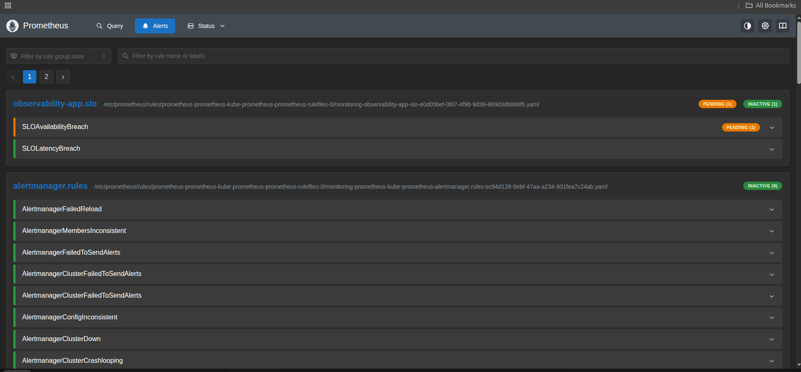

### The same alert FIRING once the breach holds for the configured 2 minutes
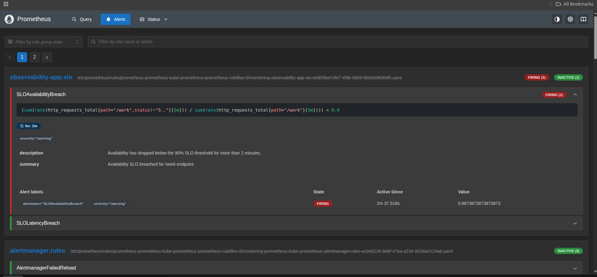

### Target health — app, Grafana, and Alertmanager all scraping successfully
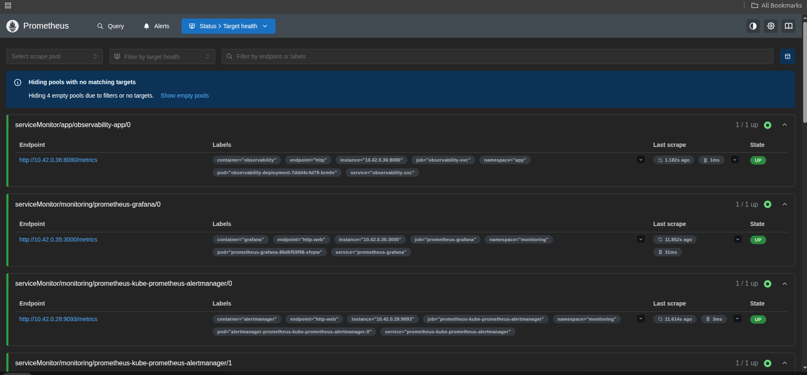

### Email notification sent the moment the SLO breach fires
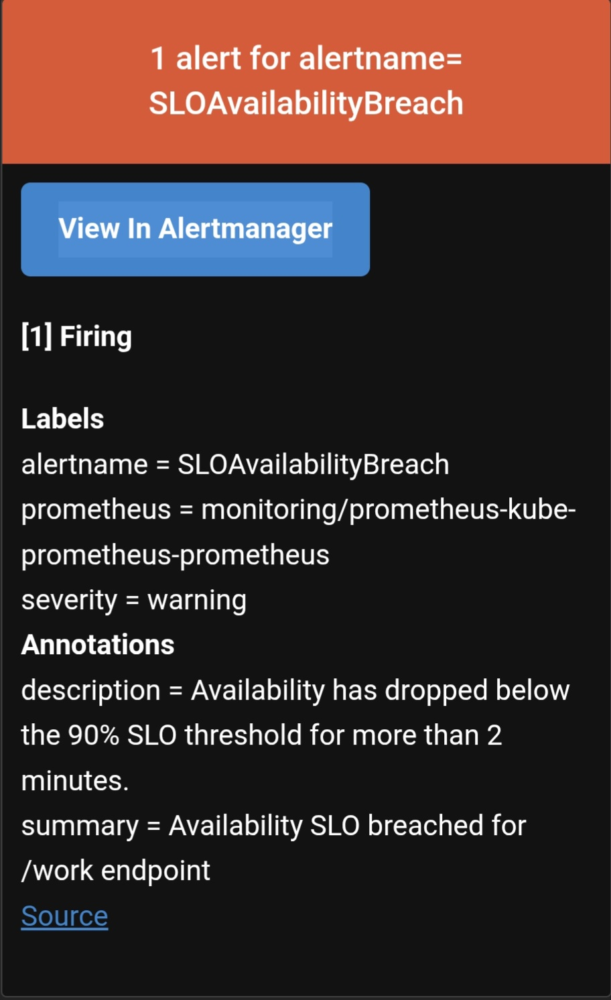

### Resolved notification once availability recovered
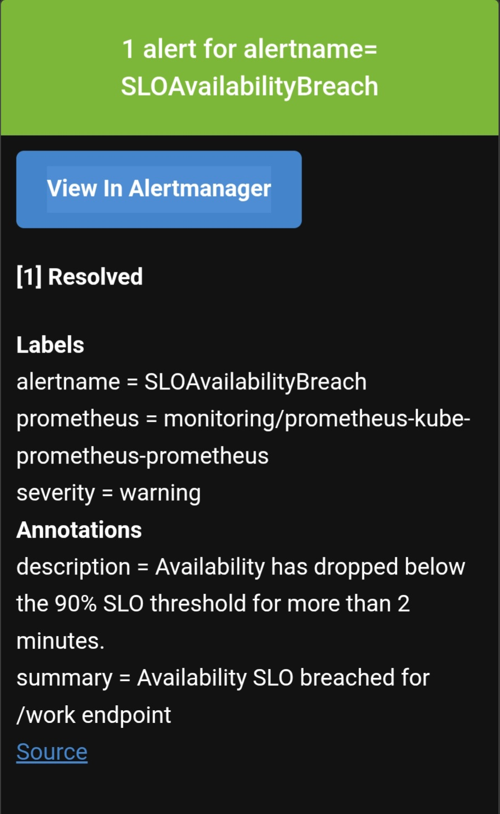

---

## How to Run

### 1. Provision the infrastructure
```bash
cd terraform
terraform init
terraform apply
```

### 2. Configure & deploy everything
```bash
cd ../ansible
cp group_vars/all/secrets.yaml.example group_vars/all/secrets.yaml   # fill in SMTP + Grafana password
./generate-inventory.sh                                            # pulls the IP from terraform output
ansible-playbook -i inventory.ini playbook.yaml
```

### 3. Access
- **Grafana** — `http://<PUBLIC_IP>/` (via Traefik Ingress, no port-forwarding)
- **Prometheus** — exposed via Ingress as well (see `ansible/roles/ingress`)

---

## App Endpoints

| Endpoint | Description |
|---|---|
| `GET /health` | Liveness check |
| `GET /ready` | Readiness check |
| `GET /work` | Simulated workload, ~10% failure rate — the endpoint behind every SLI/SLO |
| `GET /metrics` | Prometheus scrape endpoint |

---

## Alerting

Two Prometheus rules evaluate the SLOs continuously:

- **`SLOAvailabilityBreach`** — fires when `/work` availability drops below 90% for 2+ minutes
- **`SLOLatencyBreach`** — fires when p95 latency exceeds 200ms for 2+ minutes

Alertmanager is configured with Gmail SMTP and sends an email on both `firing` and `resolved` transitions.

---

<div align="center">
<sub>Part of a DevOps portfolio — <a href="https://github.com/amirhosssein0/terraform-lab">terraform-lab</a> | <a href="https://github.com/amirhosssein0/vault-cicd-lab">vault-cicd-lab</a></sub>
</div>